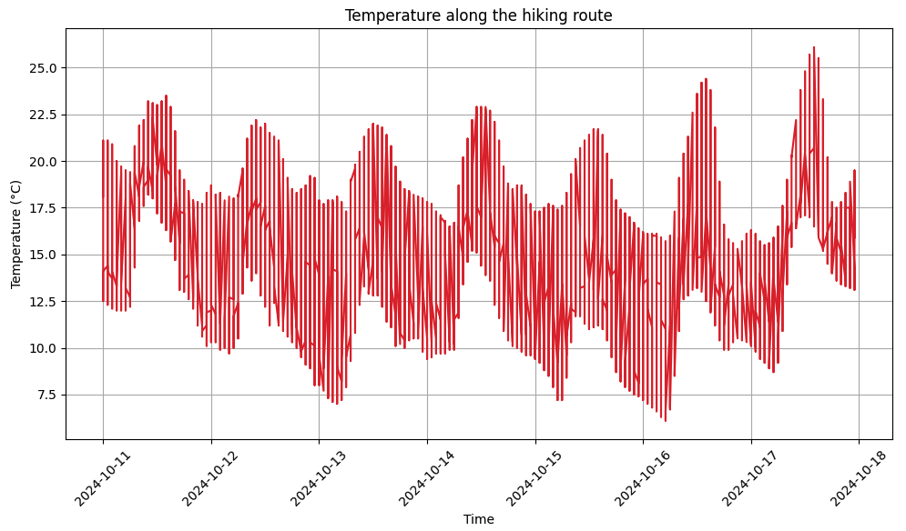
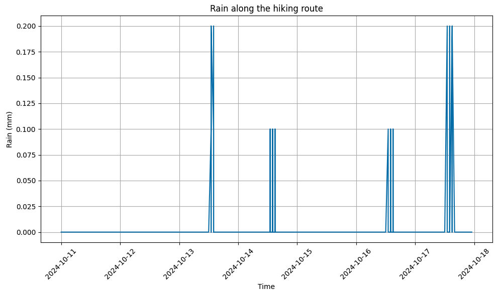
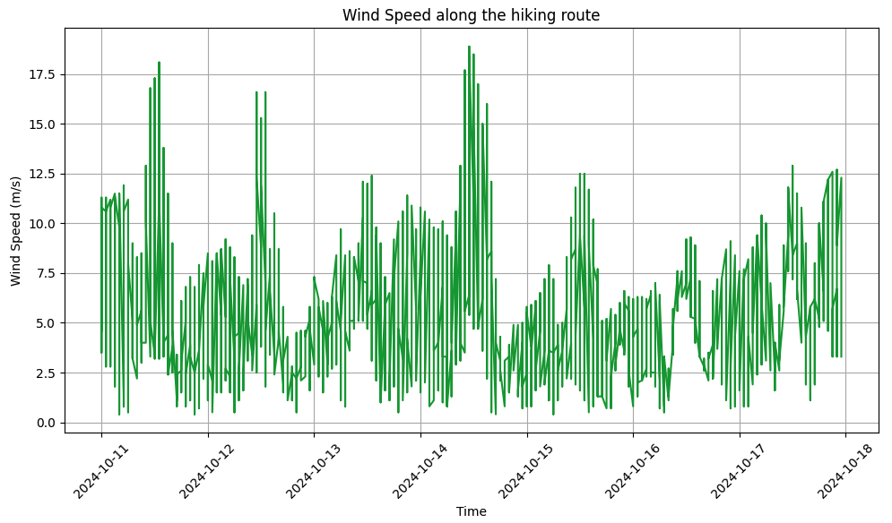
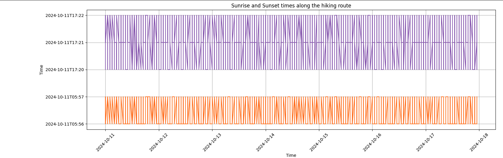

# Hiking Weather Data Visualization

This project helps you visualize weather data along a hiking route based on GPS coordinates. It utilizes the Open-Meteo API to fetch weather data for specific latitudes and longitudes from a GPX file and provides visualizations such as temperature, rain, wind speed, sunrise, and sunset.

## Table of Contents
- [Features](#features)
- [Installation](#installation)
- [Usage](#usage)
- [Files](#files)
- [API Used](#api-used)
- [Project Workflow](#project-workflow)
- [Visualizations](#visualizations)






## Features
- Fetch weather data (temperature, rain, wind speed, sunrise, and sunset) for your hiking route using GPS coordinates.
- Parallel fetching of weather data using multi-threading to speed up requests.
- Saves fetched weather data to a JSON file for future use.
- Visualizes temperature, rain, wind speed, sunrise, and sunset along the route.

## Installation

### Prerequisites
- Python 3.x
- Required packages listed in `requirements.txt`:
  - pandas
  - requests
  - matplotlib
  - tqdm
  - concurrent.futures (built-in with Python)

### Install dependencies
Use the following command to install required packages:

```bash
pip install -r requirements.txt
```

## Usage:

```bash
python hiking-plan.py
```

## Example Input:

```json
{
    "tracks": [
        {
            "segments": [
                [
                    {
                        "latitude": 36.6519,
                        "longitude": 50.749,
                        "time": "2024-10-11T13:00:00Z"
                    },
                    {
                        "latitude": 36.6520,
                        "longitude": 50.750,
                        "time": "2024-10-11T15:00:00Z"
                    }
                ]
            ]
        }
    ]
}

```

## Example Output
- A JSON file (parallel_route_weather_data.json) containing the fetched weather data.
- Visualizations of temperature, rain, wind speed, sunrise, and sunset along the hiking route.

## API Used
- This project uses the [Open-Meteo API](https://open-meteo.com/en/docs) to retrieve weather data for the specified GPS coordinates along the hiking route.

Data Retrieved:
Hourly weather data: temperature, rain, wind speed.
Daily data: sunrise and sunset times.

## Project Workflow
Fetch Weather Data: The script iterates through the hiking route's GPS coordinates and sends parallel API requests to fetch weather data.
Save Data: The fetched weather data is saved into parallel_route_weather_data.json for future use.
Visualize Data: Data like temperature, rain, wind speed, sunrise, and sunset are visualized using matplotlib.


## Visualizations
The following visualizations are generated based on the fetched weather data:

- Temperature along the hiking route
- Rain along the hiking route
- Wind Speed along the hiking route
- Sunrise and Sunset times along the hiking route
> Each visualization provides insights into the expected weather conditions at various points along your hike, making it easier to plan accordingly.
> 
> 